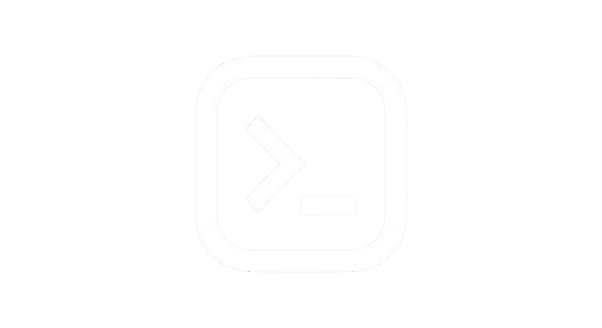

<p align="center">
  
</p>

<h1 align="center">Logos</h1>

<p align="center">
  <em>Scripts that read like thoughts.</em>
</p>

<p align="center">
  <a href="https://logos-lang.vercel.app/docs">Docs</a> ·
  <a href="https://logos-lang.vercel.app">Website</a> ·
  <a href="https://github.com/codetesla51/logos/releases">Releases</a>
</p>

---

Logos (from Greek — *word, reason, logic*) is a scripting language built for clarity. A CLI-first language with readable syntax, proper error handling, and code you can come back to a week later and still understand.
```js
use "std/array"

let devs = [
  table{name: "Alice", lang: "Go", years: 2},
  table{name: "Bob",   lang: "Python", years: 1},
  table{name: "Carol", lang: "Go", years: 3},
]

let results = devs
  |> filter(fn(d) -> d.lang == "Go")
  |> map(fn(d) -> "${d.name} — ${d.years} yrs")

for i, dev in results {
  i++
  print("  ${i}. ${dev}")
}
```

## Highlights

- **Readable syntax** — C-like, favors clarity over cleverness
- **String interpolation** — `"hello ${name}"` built in
- **Pipe operator** — chain transforms with `|>`
- **Result-based errors** — `{ok, value, error}` instead of exceptions
- **Try expression** — propagate errors without boilerplate
- **Built-in HTTP, JSON, file I/O** — batteries included
- **Concurrency** — lightweight `spawn` blocks
- **Compile to binary** — `lgs build script.lgs` produces a standalone executable
- **Embeddable** — drop into any Go project via `github.com/codetesla51/logos/logos`

## Install
```sh
curl -fsSL https://raw.githubusercontent.com/codetesla51/logos/main/install.sh | sh
```

Works on Linux and macOS. Picks the correct binary for your OS and architecture automatically.

## Quick Start
```sh
lgs script.lgs        # run a script
lgs                   # start the REPL
lgs fmt script.lgs    # format code
lgs build script.lgs  # compile to a standalone binary
lgs --help            # show all commands
```

## Docs

Full documentation at [logos-lang.vercel.app/docs](https://logos-lang.vercel.app/docs)

## Contributing

Contributions are welcome — examples, stdlib utilities, bug fixes, or docs improvements. Open an issue or PR on [GitHub](https://github.com/codetesla51/logos).

## License

MIT
